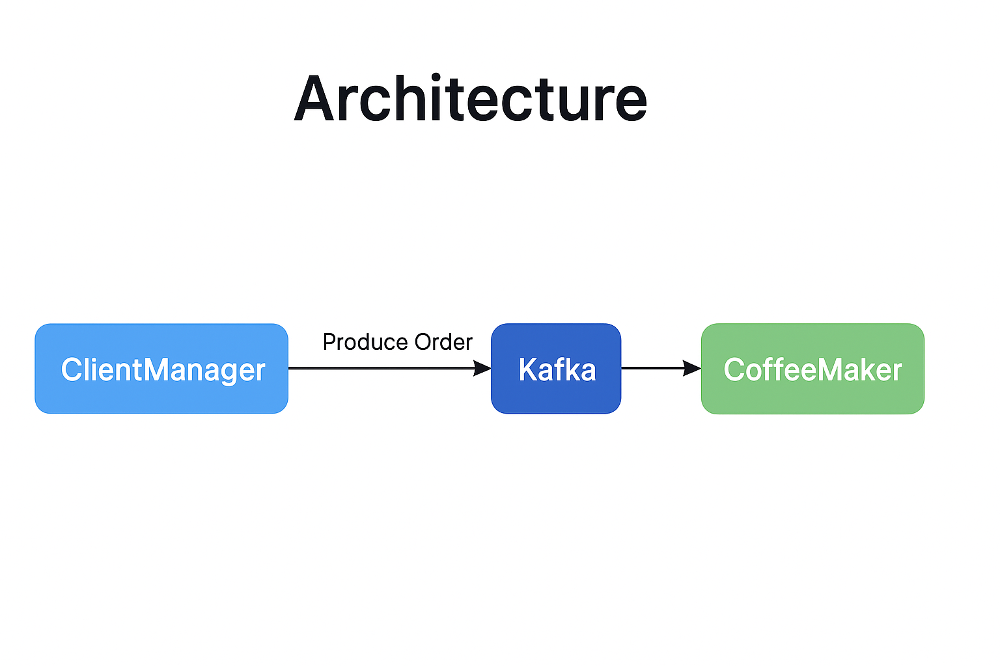

# CoffeeService ☕

CoffeeService — микросервисное приложение для управления заказами и приготовлением кофе с использованием Kafka для обмена сообщениями.

---

## Описание

CoffeeService реализует простой пример микросервисной архитектуры, включающей:

- **ClientManager** — сервис для управления клиентскими запросами и созданием заказов.
- **CoffeeMaker** — сервис, который принимает заказы через Kafka и готовит кофе.
- **Kafka** — брокер сообщений для обмена между сервисами.

Основная задача — продемонстрировать работу с Kafka на Go.

---

## Архитектура

## Технологии

Go — язык программирования
Kafka — брокер сообщений
Docker — контейнеризация и оркестрация
Segmentio kafka-go — Kafka клиент для Go